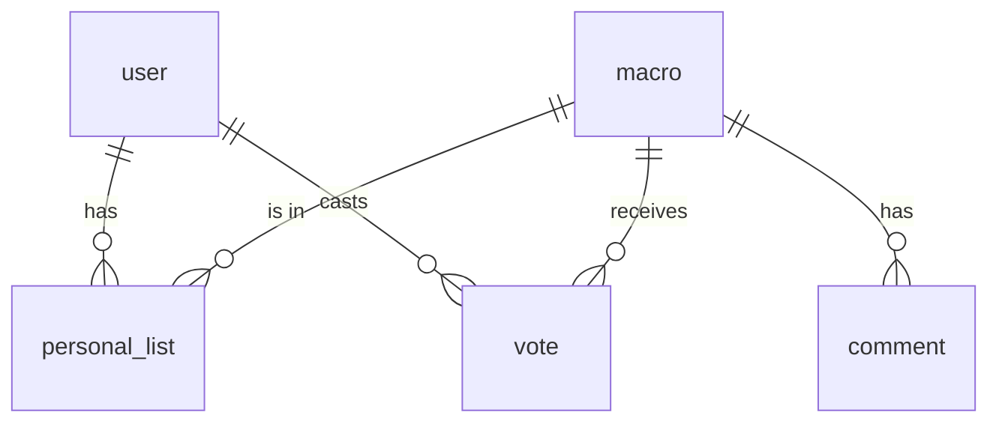
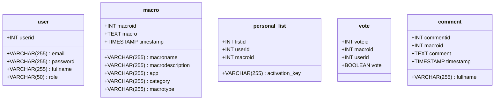

# 📦 MacroHub

**Contributors:** Juho Järvinen, Makar Korostik, Jehu Enberg, Kaito Stenroos

## 🚀 Tech Stack
- **Frontend:** React
- **Backend:** Python Script / Flask App
- **Database:** MySQL

---

## 📋 Usage Guide

### 💻 DEMO CLIENT
```bash
# Step 0: Navigate to the client directory
cd Path/to/client

# Step 1: Activate the virtual environment
./venv/Scripts/activate

# Step 2: Install required dependencies
pip install -r requirements.txt

# Step 3: Run the demo client
python macroHub.py
```

### 🐍 PYTHON CLIENT
```bash
# Step 0: Navigate to the client directory
cd ./client/

# Step 1: Install required dependencies
python -m pip install -r requirements.txt

# Step 2: Run the Python client
python .\main.py
```

### ⚙️ BACKEND
```bash
# Step 0: Navigate to the backend directory
cd ./web/app/backend/

# Step 1: (Optional) Create authenticator.js if not available
# Step 2: Start the backend server
node server.js
```
### DATABASE


#### Class diagram



### 🌐 FRONTEND
```bash
# Step 0: Navigate to the frontend directory
cd ./web/app/

# Step 1: Run the development server
npm run dev
```

### SWAGGER

If backend is run locally, by default Swagger documentation is available at:
[http://localhost:5000/swagger](http://localhost:5000/swagger)

---
