<p align="center">
  
</p>

<p align="center">
  
  
  
  
  
   
  
</p>


# 📦 MacroHub

**Contributors:** Juho Järvinen, Makar Korostik, Jehu Enberg, Kaito Stenroos

## 🚀 Tech Stack
- **Frontend:** React, Vite
- **Backend:** Node
- **Local client** Python, Inno installer
- **Database:** MySQL

---

## 📋 Developer Usage Guide

### 🐍 PYTHON CLIENT
```bash
# Step 0: Navigate to the client directory
cd ./client/

# Step 1: Activate Virtual Env
venv/scripts/activate

# Step 2: Install required dependencies
python -m pip install -r requirements.txt

# Step 3: Run the Python client
python .\main.py
OPTIONAL(no login): python .\create_macro.py 
```

### ⚙️ INSTALLER
```bash
# Step 0: Download inno compiler

# Step 1: cd ./client

# Step 2: Create exe file pyinstaller --onedir --noconsole --name Macrohub main.py

# Step 3: Navigate to the installer directory
cd ./client/installer

# Step 4: Choose the correct path to ouput dir

# Step 5: Choose the correct paths to all sources

# Step 6: Press run

```

### 🛢️ BACKEND
```bash
# Step 0: Navigate to the backend directory
cd ./web/app/backend/

# Step 1: Start the backend server
node server.js
```

### 🌐 FRONTEND
```bash
# Step 0: Navigate to the frontend directory
cd ./web/app/

# Step 1: Run the development server
npm run dev
```

### DATABASE


### Class diagram

###  Workflow

```mermaid
sequenceDiagram
    participant User as User
    participant WebClient as Web Client
    participant API
    participant LocalClient as Local Python Client

    User->>WebClient: Log in
    WebClient->>API: Authenticate user
    API-->>WebClient: Return auth token

    User->>WebClient: Browse macros
    WebClient->>API: Request macros
    API-->>WebClient: Send macro list

    User->>WebClient: Save macro to personal list
    WebClient->>API: Store macro in user’s personal list
    API-->>WebClient: Confirm save

    User->>LocalClient: Open local client
    LocalClient->>API: Request user’s personal macros
    API-->>LocalClient: Send personal macros

    User->>LocalClient: Edit and save macros
    LocalClient->>API: Update personal macros
    API-->>LocalClient: Confirm changes

```


### SWAGGER
Swagger documentation is available [here](https://macrohub-backend-6-3-25-macrohub.2.rahtiapp.fi/swagger/)

If backend is run locally, by default Swagger documentation is available at:
[http://localhost:5000/swagger](http://localhost:5000/swagger)

---
